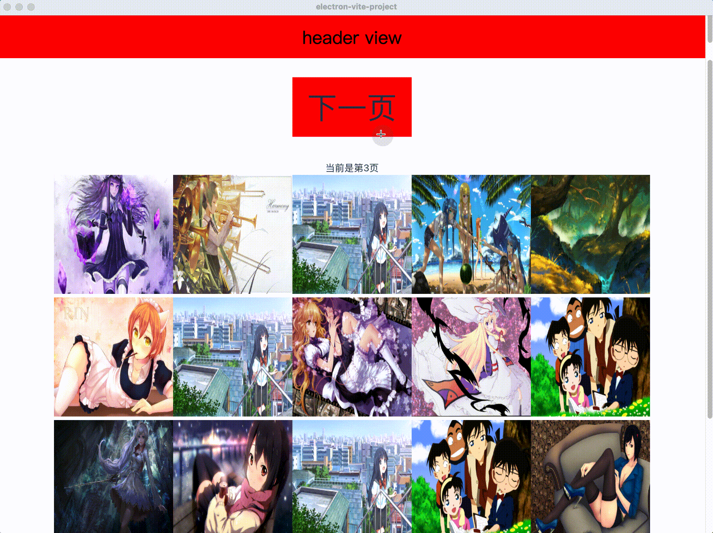

# electron 多 webview Pre-rendering container replacement demo

This is one of electron's performance optimization killers. The core idea is to render the content of the next page in advance through browserView, and replace the old browserView with the pre-rendered browserView when entering the next page.

As shown below, a common image list page. You can see that through this method, the img of the next page is rendered in advance, and there is no image loading process.

